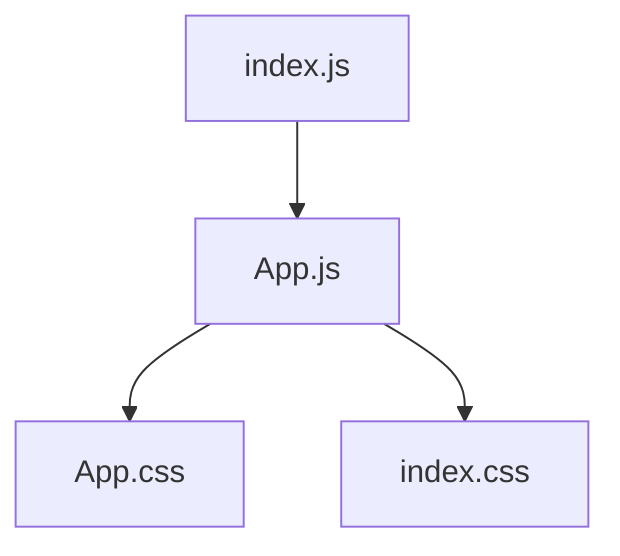
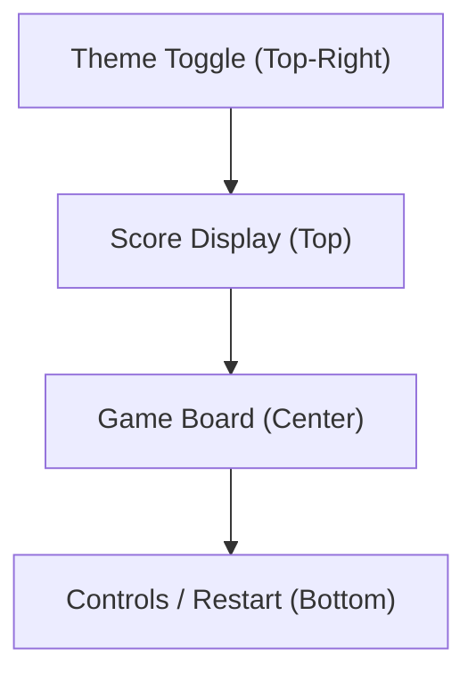

# Snake Game Frontend – Project Overview

## Introduction

The Snake Game Frontend is a modern web application built with React, providing users with a browser-based experience of the classic Snake game. This frontend application emphasizes a minimal, clean, and responsive UI, employing only vanilla CSS and React without heavy frameworks or dependencies.

---

## Table of Contents

1. [Architecture](#architecture)
2. [Key Features](#key-features)
3. [Project Structure](#project-structure)
4. [Color Scheme & Theming](#color-scheme--theming)
5. [User Interface Design](#user-interface-design)
6. [Notable Implementation Details](#notable-implementation-details)
7. [How to Run the Application](#how-to-run-the-application)

---

## Architecture

The application is a single-page app built using React, relying on functional components and hooks for state management. The main entry point is `src/index.js`, mounting the `App` component (found in `src/App.js`). CSS for theming and layout is contained in `src/App.css` and `src/index.css`, leveraging CSS variables for easy theme adjustments (light/dark mode).

A high-level component diagram (Mermaid):



---

## Key Features

- **Classic Snake Gameplay**: (Planned/expected per project description) Keyboard control of the snake in a grid-based environment, with the goal to eat food while avoiding collisions.
- **Score Display**: Shows the player's current score, updated live as the game progresses.
- **Game Over Dialog**: When the snake hits itself or a wall, a clear "Game Over" screen is displayed.
- **Restart Option**: Players can restart the game at any time after losing.
- **Responsive and Accessible UI**: The layout adapts to different devices and screen sizes.
- **Theme Toggle**: Supports both light and dark color schemes, switchable via a button in the UI.
- **Minimal Dependencies**: Uses only React and vanilla CSS to ensure a lightweight, fast-loading experience.

---

## Project Structure

```
snake_game_frontend/
├── README.md                # Project-level readme
├── eslint.config.mjs        # ESLint configuration for code standards
├── package.json             # Project metadata, scripts, dependencies
├── post_process_status.lock # Build/test status lock file
└── src/
    ├── App.css              # Main application styles and theming
    ├── App.js               # Main React component (UI, theming)
    ├── App.test.js          # Unit tests for App.js
    ├── index.css            # Global CSS (font stack, etc.)
    ├── index.js             # Entry point, renders App
    └── setupTests.js        # Testing utilities setup
```

---

## Color Scheme & Theming

The application supports both light and dark modes via CSS variables, allowing easy and dynamic theming.

**Light Theme Variables:**
- `--bg-primary`: #ffffff (main background)
- `--bg-secondary`: #f8f9fa (panel/secondary background)
- `--text-primary`: #282c34 (primary text)
- `--text-secondary`: #61dafb (accent text)
- `--border-color`: #e9ecef (borders, separators)
- `--button-bg`: #007bff (primary button background)
- `--button-text`: #ffffff (button text)

**Dark Theme Variables (`[data-theme="dark"]`):**
- `--bg-primary`: #1a1a1a
- `--bg-secondary`: #282c34
- `--text-primary`: #ffffff
- `--text-secondary`: #61dafb
- `--border-color`: #404040
- `--button-bg`: #0056b3
- `--button-text`: #ffffff

The color palette in the project description also suggests:
- **Primary**: #2e8b57 (a green shade for snake/gameboard)
- **Secondary**: #333333 (background or border elements)
- **Accent**: #ffd700 (food/highlight)

These accent colors can be readily incorporated or overriden in the CSS as the game UI evolves.

---

## User Interface Design

### Layout and Components

- **Centered Layout**: The main game area is horizontally and vertically centered.
- **Score Display**: Placed at the top of the game area, styled simply for clarity.
- **Game Area**: The central board, where Snake is rendered. (Future implementation: grid-based canvas/divs).
- **Controls Area**: Below the board, provides keyboard hints and possibly restart/game over actions.
- **Theme Toggle Button**: Fixed in the top-right corner, offers light/dark switching with an icon (`🌙` for dark, `☀️` for light).
- **Responsive Design**: Use of viewport-relative units and media queries (`App.css`) ensures mobile and desktop compatibility.

**Component Classes and Usage**
- `.App` - Main application wrapper, handles overall styling and background.
- `.App-header` - Contains all main UI elements, uses flexbox for vertical arrangement.
- `.theme-toggle` - Floating button for switching the display theme, visually elevated, with hover and active feedback.
- `.App-link` - Styled link (currently to React documentation in template stage).

### UI Example Visual Flow (Mermaid):



---

## Notable Implementation Details

- **Theme Toggle Logic**: The theme toggle feature is implemented in `App.js` with React's `useState` and `useEffect`, updating the HTML `data-theme` attribute to trigger CSS variable changes.
- **Testing**: Basic unit tests for component rendering and UI with `react-testing-library` (see `App.test.js` and `setupTests.js`).
- **ESLint Setup**: Custom ESLint configuration in `eslint.config.mjs` to enforce consistent code style, including support for JSX/React globals and ignoring unused React import in the new JSX transform.
- **No Heavy Framework**: UI is built with only CSS and HTML for clarity and maintainability.

---

## How to Run the Application

From `snake_game_frontend` directory:

- **Start Development Server**
  ```
  npm start
  ```
  Open [http://localhost:3000](http://localhost:3000) to view the app.

- **Run Tests**
  ```
  npm test
  ```

- **Build for Production**
  ```
  npm run build
  ```

---

## Future Enhancements

While the template currently focuses on structure and theming, the following features are outlined in the project description for implementation:
- Core snake game loop and rendering
- Score tracking and display
- Game over and restart logic
- Richer accessibility and keyboard input handling

---

## References

- [React Documentation](https://reactjs.org/)
- [CSS Variables & Theming](https://developer.mozilla.org/en-US/docs/Web/CSS/Using_CSS_custom_properties)

---

_Last updated: [Automated Documentation, YYYY-MM-DD]_

